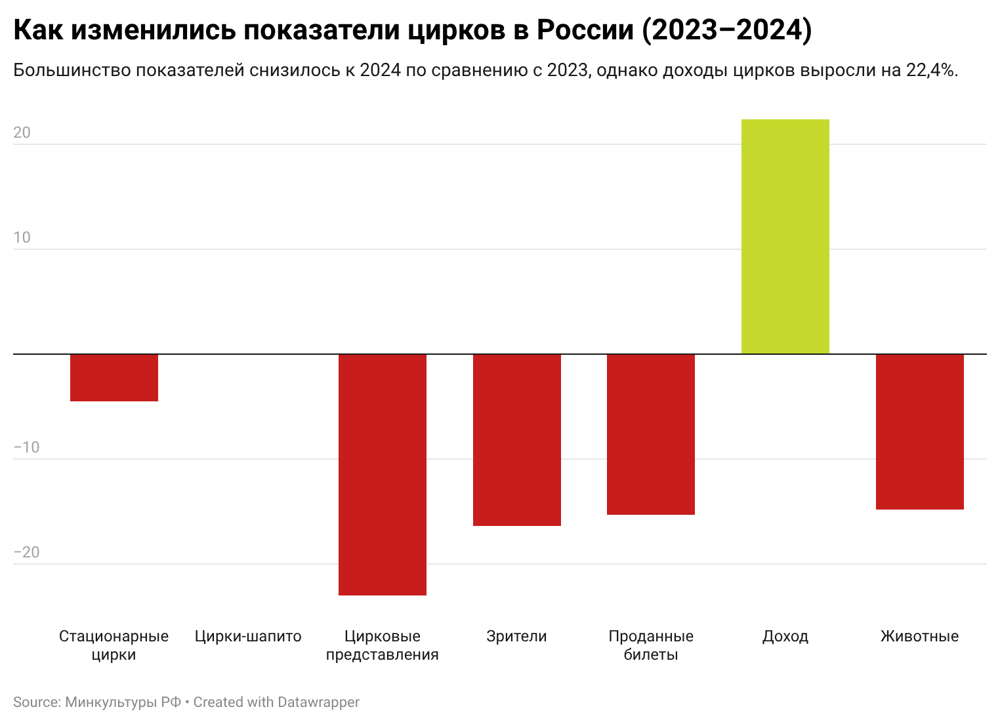
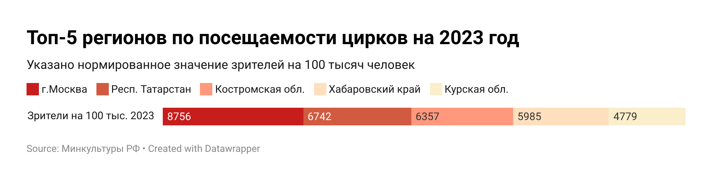
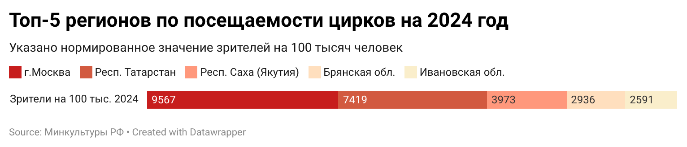
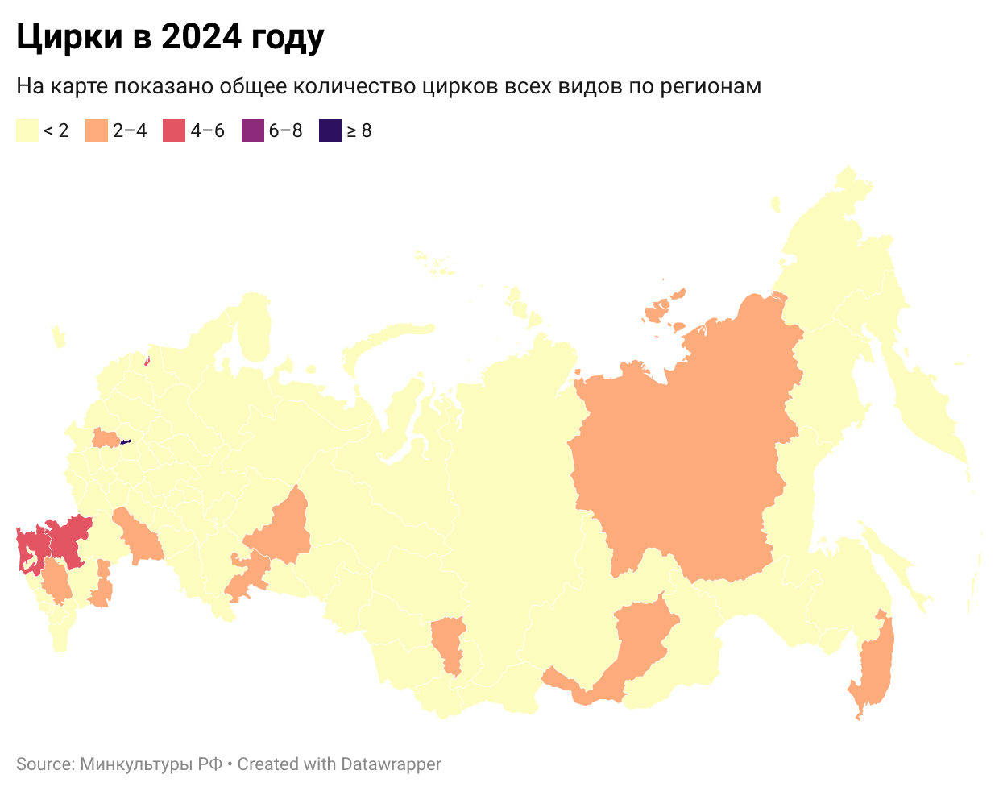

# 🎪 Трансформация цирковой индустрии в России (2023–2024)

## Синопсис
Данный проект посвящён анализу состояния цирковой индустрии в России в 2023–2024 годах на основе открытых данных. В исследовании рассматриваются ключевые показатели: количество цирков, число представлений, посещаемость, доходы, а также использование животных в цирковых программах.

Особое внимание уделяется региональным различиям в популярности цирка: анализируется посещаемость с учётом численности населения, а также пространственное распределение цирков по территории страны.

---

## Актуальность
Цирковая индустрия находится в стадии трансформации. Меняются общественные ценности, особенно в отношении использования животных, а также экономическая модель отрасли.

Несмотря на снижение посещаемости, доходы цирков растут, что делает исследование особенно актуальным.

---

## Исследовательские вопросы
- Как изменились ключевые показатели цирковой индустрии с 2023 по 2024 год?
- Возрастает или снижается количество цирков?
- В каких регионах цирк наиболее популярен с учётом численности населения?
- Как распределена цирковая инфраструктура по регионам России?
- Как меняется роль животных в цирковой индустрии?

---

## Данные
В проекте использованы открытые данные:
- Министерство культуры РФ
- Росстат

Обработка данных включала:
- приведение названий регионов к единому формату  
- объединение таблиц по годам и населению через pandas на python, сводные таблицы и формулы в google sheets
- расчёт дополнительных показателей  
- подготовку таблиц для визуализации  

Данные: [data/](data/)

---

## Анализ

В рамках проекта были проанализированы ключевые показатели цирковой индустрии России за 2023–2024 годы, а также их региональные различия. Для этого были построены четыре визуализации, отражающие динамику отрасли и пространственное распределение цирков.

---

### Сравнение ключевых показателей (2023–2024)

Анализ показал, что в 2024 году по сравнению с 2023 наблюдается снижение большинства количественных показателей:

- количество цирковых представлений сократилось  
- общее число зрителей уменьшилось  
- количество проданных билетов снизилось  
- уменьшилось число животных, используемых в цирках  

При этом был зафиксирован **рост доходов от цирковых мероприятий**.

Это может свидетельствовать о следующих тенденциях:
- рост средней стоимости билетов  
- изменение формата представлений (например, более коммерчески ориентированные шоу)  
- снижение массовости при увеличении доходности  

Таким образом, цирковая индустрия демонстрирует переход от массовой модели к более коммерчески эффективной.

---

### Топ регионов по посещаемости (2023)

Для корректного сравнения регионов был использован показатель **“количество зрителей на 100 тыс. человек”**, что позволило исключить влияние размера населения.

Анализ показал, что:
- лидерами по посещаемости являются не только крупнейшие регионы  
- высокий уровень посещаемости наблюдается в ряде менее населённых субъектов  
- цирк может играть более значимую роль в культурной жизни отдельных регионов  

Это говорит о том, что популярность цирка определяется не только масштабом региона, но и локальными культурными особенностями и доступностью инфраструктуры.

---

### Топ регионов по посещаемости (2024)

Сравнение с 2023 годом показывает изменения в распределении лидеров:

- часть регионов сохраняет высокие позиции  
- появляются новые регионы-лидеры  
- в некоторых субъектах наблюдается снижение посещаемости  

Это указывает на нестабильность спроса на цирковое искусство и возможное влияние:
- экономических факторов  
- изменений в культурных предпочтениях населения  
- доступности цирковых мероприятий  

---

### Пространственное распределение цирков (2024)

Карта показывает значительную неравномерность распределения цирковой инфраструктуры по территории России:
- наибольшая концентрация цирков наблюдается в крупных городах и экономически развитых регионах  
- в ряде регионов цирки полностью отсутствуют  
- значительная часть территории страны имеет ограниченный доступ к цирковым представлениям  

Из этого можно заключить, что:
- доступность цирка напрямую связана с уровнем развития региона  
- цирковая инфраструктура сконцентрирована в центрах притяжения населения  

---

## Обобщение результатов

Проведённый анализ позволяет выделить несколько ключевых тенденций:

1. **Снижение массовости**  
   Цирковая индустрия теряет часть аудитории, что отражается в снижении числа зрителей и мероприятий.  
2. **Рост экономической эффективности**  
   Несмотря на снижение посещаемости, доходы цирков увеличиваются.  
3. **Региональная неоднородность**  
   Популярность цирка существенно различается между регионами.  
4. **Неравномерная доступность**  
   Цирки сосредоточены в ограниченном числе регионов, что влияет на уровень вовлечённости населения.  
5. **Снижение использования животных**  
   Уменьшение числа животных может свидетельствовать о трансформации цирка под влиянием общественных и этических факторов.  

---

## Общий вывод

*Проведённый анализ показывает, что распределение цирковой инфраструктуры в России является неравномерным: цирки сосредоточены преимущественно в отдельных регионах, в то время как значительная часть субъектов имеет ограниченный доступ к цирковым представлениям.*

*При этом результаты нормализации данных по численности населения демонстрируют, что лидерами по посещаемости являются не только крупнейшие и столичные регионы, но и ряд менее населённых субъектов, где цирк сохраняет высокую популярность.*

*Одновременно наблюдается снижение количества цирков и числа животных, используемых в представлениях, что может свидетельствовать о структурных изменениях в отрасли. На фоне этого фиксируется рост доходов от цирковой деятельности, что указывает на изменение экономической модели цирков — переход от массовости к большей коммерческой эффективности.*

---

## Референсы
- [исследование ВЦИОМ](https://wciom.ru/analytical-reviews/analiticheskii-obzor/cirk-na-scene-i-za-kulisami)  
- [статья Forbes](https://www.forbes.ru/forbeslife/510852-peticia-protiv-ispol-zovania-zivotnyh-v-cirkah-sobrala-bolee-110-000-podpisej) 
- [статья КиберЛенинка](https://cyberleninka.ru/article/n/tsirkovoe-iskusstvo-v-sovremennom-mire)  

---

## Инструменты
- Google Таблицы  
- Python (pandas)  
- Datawrapper  
- GitHub  
